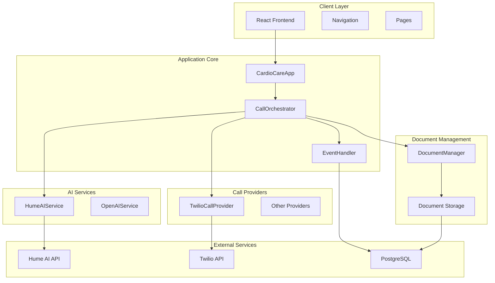
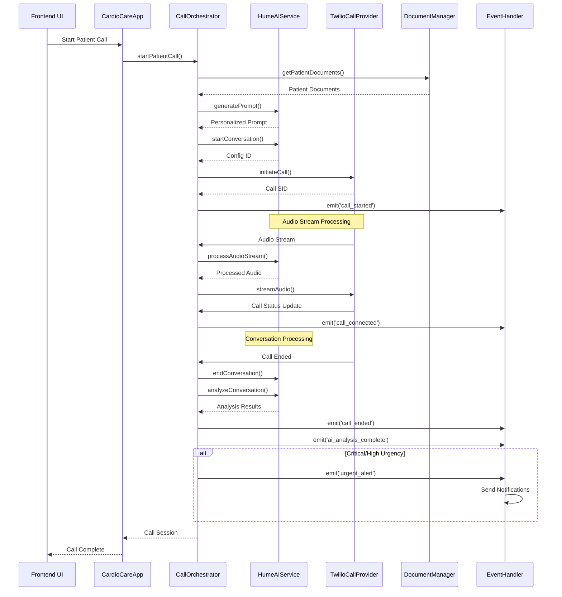
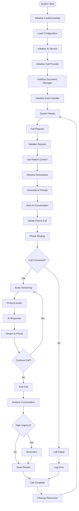
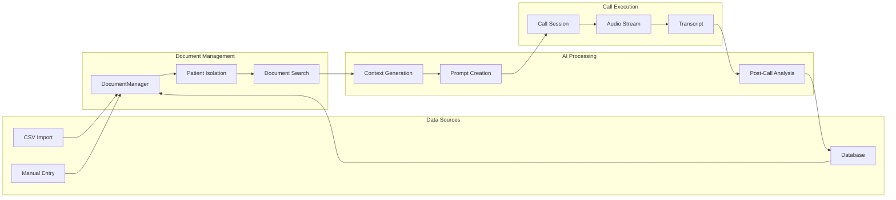
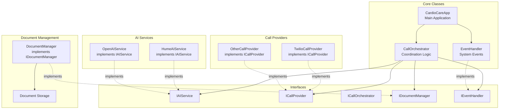
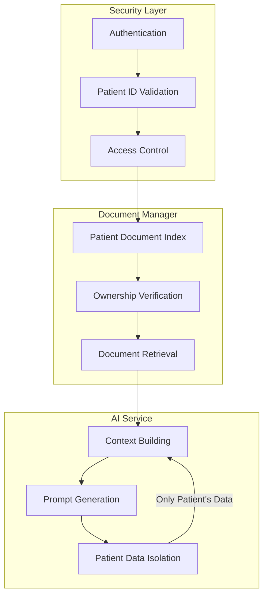
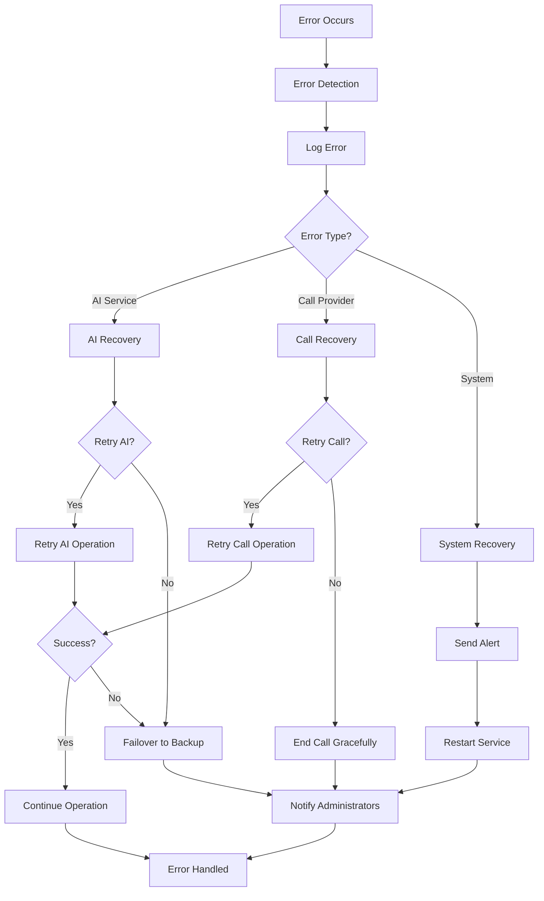
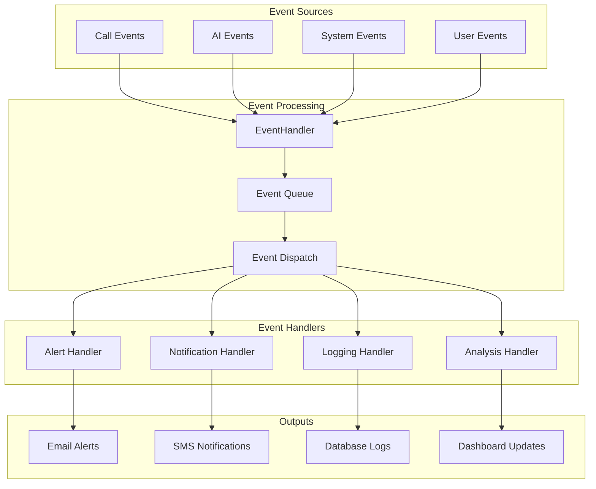
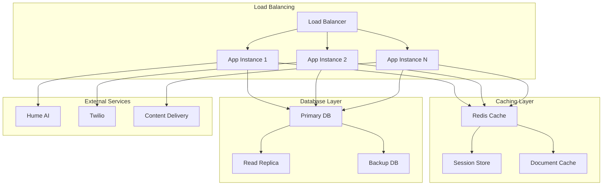

# CardioCare AI - Architecture Flowcharts

## High-Level System Architecture

## Call Flow Architecture

## General System Flow

## Patient Data Flow

## Component Interaction Diagram

## Data Isolation Security Model

## Error Handling Flow

## Event-Driven Architecture

## Performance & Scaling Considerations

